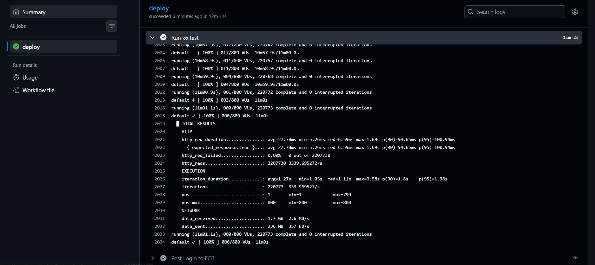
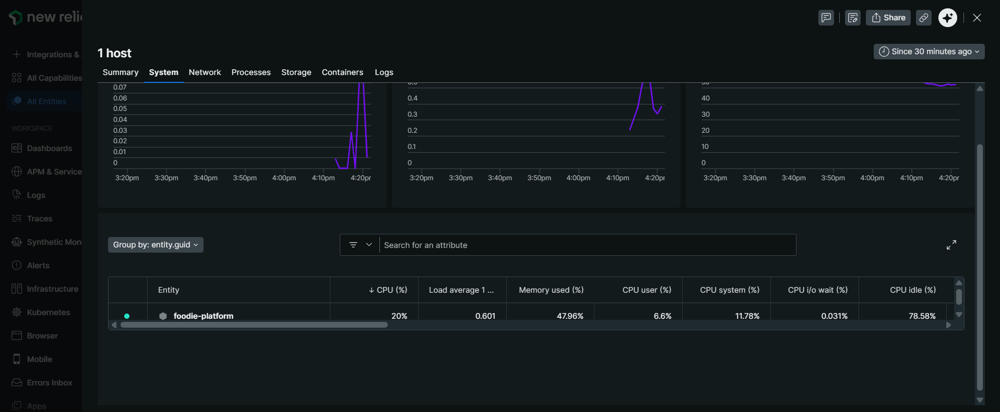
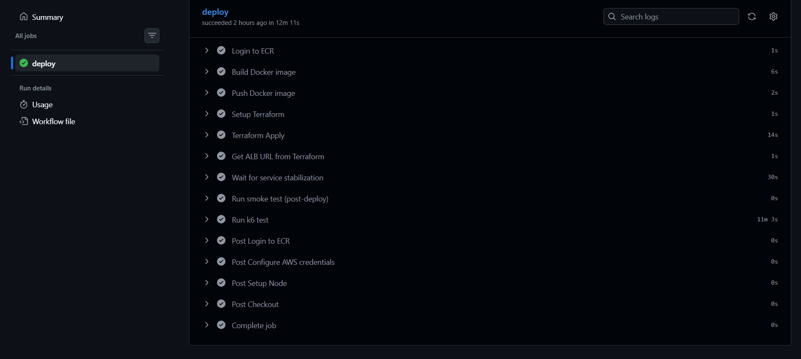
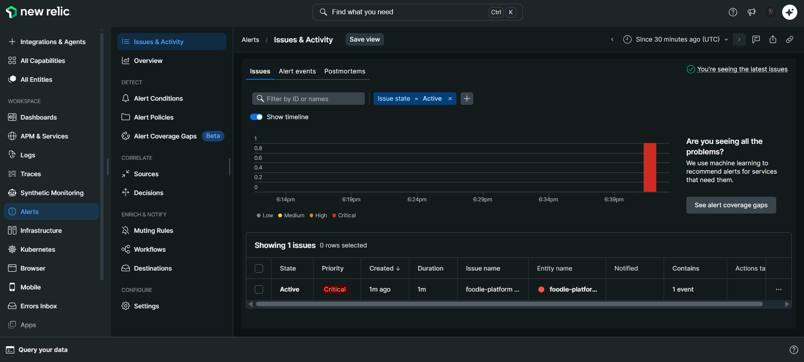

# 🚀 Foodie Platform – Production-Grade DevOps Pipeline

---

## Problem Statement

Built an end-to-end DevOps pipeline to deploy, test, monitor, and alert on a containerized web application using AWS and modern DevOps tooling.

The goal was to simulate a real-world production system that can:

- Automatically deploy code changes
- Handle traffic under load
- Provide observability into system behavior
- Trigger alerts based on system signals

---

## Architecture

This project integrates multiple DevOps tools and cloud services:

- **GitHub Actions** – CI/CD pipeline with OIDC authentication (no static secrets)
- **Docker** – Containerization of the application
- **AWS ECS (Fargate)** – Serverless container orchestration
- **AWS ALB (Application Load Balancer)** – Traffic routing
- **AWS ECR** – Container image registry
- **Terraform** – Infrastructure as Code (IaC)
- **New Relic** – Monitoring and alerting
- **k6** – Load testing

---

## Pipeline Flow
Code Push
→ GitHub Actions Trigger
→ Install & Build
→ Docker Build
→ Push to ECR
→ Terraform Apply (Deploy to ECS)
→ Smoke Test
→ Load Test (k6)
→ Metrics Collection (New Relic)
→ Alert Triggering

---

## Observability + Alerting

- Integrated **New Relic Infrastructure Agent** into ECS (sidecar container)
- Built **NRQL-based alert conditions**
- Triggered alerts using simulated traffic via k6
- Verified full alert lifecycle:
  - Detection
  - Issue creation
  - Notification workflow

---

## Load Testing

- Integrated **k6 load testing** into CI pipeline
- Simulated concurrent users hitting the application
- Observed system behavior under load
- Identified that the application is **I/O-bound (NGINX static serving)**, not CPU-bound

---

## Screenshots

### 🔹 Load Test Execution

### 🔹 Metrics Observed in New Relic

### 🔹 CI/CD Pipeline Success

### 🔹 Alert Triggered (Incident Created)

---

## Key Learnings

- Not all systems scale based on CPU — **NGINX is I/O-bound**
- Switched from CPU-based alerts to **request-rate-based alerting**
- Built a full **observability feedback loop**:
Load → Metrics → Alert → Incident
- Implemented **secure CI/CD using OIDC**, eliminating static AWS credentials
- Learned how to debug real-world issues:
- Deployment propagation issues
- ECS task revisions
- Metric selection for alerting

---

## Future Improvements

- Add **Distributed Tracing (APM)** for deeper insights
- Implement **Blue/Green deployments**
- Introduce **Chaos Engineering (failure simulation)**
- Add **Auto-remediation workflows**
- Migrate to **Kubernetes (EKS)** for advanced orchestration

---

## Summary

This project demonstrates the ability to:

- Design and deploy production-style infrastructure
- Automate delivery pipelines
- Monitor and analyze system behavior
- Build alerting systems based on real signals

---

## Key Concept

> “A system is not complete until it can be observed, tested under pressure, and respond to failure.”

---

